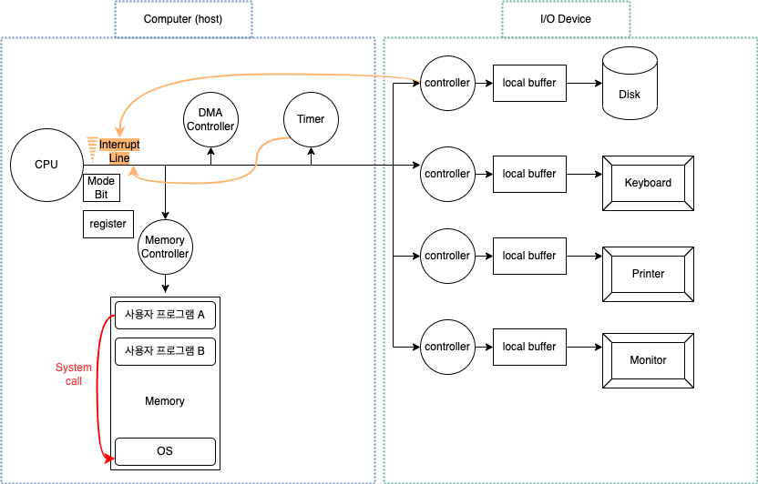

## 컴퓨터 시스템의 구조

컴퓨터의 업무 처리 방식: 컴퓨터 외부 장치에서 컴퓨터 내부로 데이터를 읽어와서 각종 연산을 수행 후, 그 결과를 컴퓨터 외부 장치로 다시 내어 보내는 방식. 컴퓨터 내부로 데이터가 들어오는 것이 입력(input), 외부 장치로 데이터가 나가는 것은 출력(output)이다.

- 입출력 장치: 컴퓨터 외부 장치를 입출력 장치라고도 한다.
- 컨트롤러: 컴퓨터 내의 하드웨어 장치에 존재하는 일종의 작은 CPU
- 커널: 운영 체제 중 항상 메모리에 올라가 있는 부분

## CPU와 I/O 연산

- `CPU`: 컴퓨터 내에서 수행되는 연산을 담당한다. 매시점 메모리에서 명령을 하나씩 읽어와서 수행한다.
  - `인터럽트 라인`: CPU 옆에 있는데, CPU가 자신의 작업을 하던 중 인터럽트 라인에 신호가 들어오면 하던 일을 멈추고 인터럽트와 관련된 일을 처리한다. _작업이 다 끝났는지 어떤지 전달받는 역할을 한다._
- `I/O 연산`: 입출력 장치의 I/O 연산은 I/O 컨트롤러가 담당한다.

  - `컨트롤러`: 입출력 장치와 메인 CPU는 동시 수행이 가능한데, 이를 제어하기 위해 장치 컨트롤러가 있다. 키보드 입력 등의 _이벤트를 CPU에게 알려 줄 필요가 있는 경우 컨트롤러가 발생시킨다._
    - 디스크나 키보드 등의 장치에서 로컬 버퍼로 데이터를 읽어오는 일을 담당한다.
    - 인터럽트를 발생시켜 CPU에 보고하여 데이터를 모두 가지고 왔는지 아닌지를 체크한다.
  - `로컬 버퍼(local buffer)`: 장치로부터 들어오고 나가는 데이터를 임시로 저장하기 위한 작은 메모리. 로컬 버퍼에 임시 저장되어 있던 데이터는 이후 메모리에 전달된다.

- _사용자 프로그램은 어떻게 I/O를 할까?_
  - System call: 사용자 프로그램은 운영체제에게 I/O 요청
  - trap을 이용하여 이너럽트 벡터의 특정위치로 이동
  - 제어권이 인터럽트 벡터가 가리키는 인터럽트 서비스 루틴으로 이동
  - 올바른 I/O 요청인지 확인 후 수행
  - I/O 완료 시 제어권을 시스템 콜 다음 명령으로 옮긴다.

---

> 인터럽트: 인터럽트 당한 시점의 레지스터와 Program Counter를 save한 후 CPU의 제어를 인터럽트 처리 루틴에 넘긴다.

## 인터럽트의 일반적인 기능

*일반적으로 인터럽트는 하드웨어가 발생시킨 인터럽트*를 뜻하지만 넓은 의미의 인터럽트는 하드웨어와 소프트웨어 인터럽트 모두를 말한다. 두 가지의 차이점은 일을 수행하는 방식에 있어서 하드웨어 인터럽트는 컨트롤러 등 **하드웨어 장치가 CPU의 인터럽트 라인을 세팅하는 방식**이고, 소프트웨어 인터럽트는 소프트웨어가 그 일을 수행한다.

- 하드웨어 인터럽트: 하드웨어가 발생시킨 인터럽트
- 소프트웨어 인터럽트(Trap)
  - exception: 프로그램이 오류를 범한 경우
  - system call: 프로그램이 커널 함수를 호출한 경우. 운영체제에 정의된 함수를 호출하는 것.

## 인터럽트 핸들링

> 인터럽트가 발생한 경우 처리해야 할 일의 절차

## 하드웨어 인터럽트

### 인터럽트 관련 용어

- `인터럽트 처리 루틴(interrupt service routine)`: 인터럽트 핸들러. 커널 내에 존재하는 해당 인터럽트를 처리하는 커널 함수. 다양한 인터럽트들이 각각 처리해야 할 업무들을 정의하고 있다.
- `인터럽트 벡터`: 여러 가지 인터럽트에 대해 해당 인터럽트 발생시 처리해야 할 루틴의 주소를 보관하고 있는 테이블. 인터럽트 종류마다 번호가 있고, 그 번호에 따라 처리해야 할 코드의 위치를 포인터로 가리키고 있는 자료 구조. 해당 인터럽트의 처리 루틴 주소를 가지고 있다.
- `Mode bit`: 하드웨어의 보안을 위한 장치. 사용자 프로그램의 잘못된 수행으로 다른 프로그램 및 운영체제에 피해가 가지 않도록 하기 위한 보호장치. Mode bit을 통해 하드웨어적으로 두 가지 모드의 operation 지원

  > `1` 사용자 모드 : 사용자 프로그램 수행
  > `0` 모니터 모드 : OS 코드 수행 (=커널 코드, 시스템 모드)

  - 보안을 해 칠 수 있는 중요한 명령어는 모니터 모드에서만 수행가능한 `특권명령`으로 규정된다.
  - 인터럽트나 exception 발생 시 하드웨어가 Mode bit을 `0`으로 바꾼다.
  - 사용자 프로그램에게 CPU를 넘기기 전에 Mode bit을 `1`로 세팅한다.

- `I/O Device Controller` : 해당 I/O 장치 유형을 관리하는 일종의 작은 CPU.
  - 제어 정보를 위해 control register, status register를 가진다.
  - I/O는 실제 device와 local buffer 사이에서 일어난다.
  - **Device controller는 I/O가 끝났을 경우 인터럽트로 CPU에 그 사실을 알린다.**
- `Device driver (장치구동기)`: OS 코드 중 각 장치별 처리 루틴 -> `software`
- `Device Controller`: 각 장치를 통제하는 일종의 작은 CPU -> `hardware`
- `Timer`: 정해진 시간이 흐른 뒤 운영체제에게 제어권이 넘어가도록 인터럽트를 발생시킨다.
  - 타이머는 매 클릭 틱 때마다 1씩 감소한다.
  - 타이머 값이 0이 되면 타이머 인터럽트가 발생한다.
  - **CPU를 특정 프로그램이 독점하는 것으로부터 보호한다.**
  - Time sharing을 구현하기 위해 널리 이용된다.
  - 현재 시간을 계산하기 위해서도 사용된다.
- `Register`: 메모리보다 더 빠르면서 정보를 저장할 수 있는 공간. 두 개의 레지스터를 사용하여 프로그램이 접근하려는 메모리 부분이 합법적인지 체크하여 메모리 보호가 이루어진다.
  - 기준 레지스터(base register): 어떤 프로그램이 수행되는 동안 그 프로그램이 합법적으로 접근할 수 있는 메모리 상의 가장 작은 주소를 보관.
  - 한계 레지스터(limit register): 그 프로그램이 기준 레지스터 값부터 접근할 수 있는 메모리의 범위를 보관.
  - 사용자 프로그램은 기준 레지스터 + 한계 레지스터 사이의 주소 영역만 접근 가능하고, 접근하려는 주소가 이 범위 안에 없으면 예외 상황이라는 소프트웨어 인터럽트를 발생시켜 CPU의 제어권을 빼앗는다.
- 시스템 콜: 입출력 명령은 운영 체제 코드에 구현되어 있어서 사용자 프로그램은 직접 입출력을 수행하는 대신 **운영 체제에게 시스템 콜이라는 서비스 대행 요청을 하여 입출력을 수행한다.**

### 인터럽트 수행 순서

1. 이벤트가 발생하여 컨트롤러가 인터럽트를 발생시킨다. 예를 들어 *Disk에서 읽어오라.*와 같은 명령을 만나면 CPU가 Disk에 직접 접근하지 않고, OS가 Disk의 Controller에 일을 시키고, 수행한 일은 local buffer에 집어 넣는다. 일이 끝나면 local buffer에 있는 내용을 해당 일을 시킨 프로그램에 copy해준다.
2. CPU는 하던 일을 멈추고, 인터럽트 벡터를 확인하고, 해당 인터럽트가 있는 위치를 찾아간다.
3. 인터럽트 서비스 루틴을 통해 해당하는 인터럽트 처리를 완료한다.
4. 인터럽트의 처리가 완료되었으므로 CPU를 점령당하기 이전의 인터럽트로 돌아가서 하던 작업을 다시 처리한다.

## 소프트웨어 인터럽트

프로세스가 0으로 나누는 연산 등을 시도하거나 프로그램이 수행되다가 접근해서는 안 되는 메모리 영역에 접근하려 할 때 발생한다. 트랩(Trap)라고도 불린다. 하드웨어 인터럽트처럼 컨트롤러가 발생시키는 것이 아니고, **프로그램 수행 도중 직접 CPU에 인터럽트 라인을 세팅하여 발생시킨다.**

---

## 입출력 구조

> 입출력(I/O): 컴퓨터 시스템이 컴퓨터 외부의 주변 장치들과 데이터를 주고 받는 것

입출력 명령어는 다음의 두 가지 방식으로 수행된다.

- I/O를 수행하는 special instruction에 의해
- Memory Mapped I/O에 의해

입출력 구조는 동기식 입출력, 비동기식 입출력의 두 가지 방식이 있다. 이 두 가지는 CPU의 제어권 부여 방식에 차이가 있는데, **두 경우 모두 입출력이 완료되었을 때 인터럽트를 통해 알린다.**

### 동기식 입출력

- **입출력 요청 후 작업이 완료된 후에야 CPU의 제어권이 사용자 프로그램에게 다시 넘어간다.**
- 입출력 연산이 끝날 때까지 CPU는 아무 일도 수행할 수 없다. 이 상태를 `봉쇄 상태`라고 한다.
- 입출력 요청의 동기화를 위해 `큐(Queue)`를 두어 요청 순서대로 처리될 수 있도록 한다. 그 이유는 다수의 입출력이 동시에 요청되거나 처리되는 경우 요청 순서가 뒤바껴 의도치 않은 결과를 일으킬 수 있기 때문이다. 장치마다 큐 헤더가 존재하고 각 장치별로 입출력 수행 순서를 지켜 주기 위한 큐를 관리한다. 컨트롤러는 이 순서에 따라서 매 시점 하니씩 자신에게 주어진 입출력 작업을 처리한다.

### 비동기식 입출력

- 입출력 연산을 요청한 후에 연산이 끝나기를 기다리는 것이 아니라 **CPU의 제어권을 입출력 연산을 호출한 그 프로그램에게 곧바로 부여한다.**
- 입출력 연산이 완료되는 것과 무관하게 처리가 가능한 작업을 먼저 처리한다.

---

## DMA (Direct Memory Access)

> CPU가 주변 장치들의 메모리 접근 요청에 의해 자주 인터럽트 당하는 것을 막아주는 역할

- 원칙적으로 메모리는 CPU에 의해서만 접근 가능한데 이렇게 될 경우 주변 장치가 메모리 접근을 원할 때마다 인터럽트를 통해 CPU의 업무가 방해받는 비효율이 발생한다.
- **이러한 CPU 사용의 비효율을 극복하기 위해 CPU 외에 메모리 접근이 가능한 장치인 DMA를 두는 것이다.**
- DMA가 로컬 버퍼에서 메모리로 읽어오는 작업을 대행하기 때문에 CPU에 발생하는 인터럽트 빈도가 줄어든다.
- DMA는 바이트 단위가 아닌 `block 단위`로 인터럽트를 발생시킨다.

---

## 저장 장치의 구조

> 컴퓨터의 저장 창치는 주 기억 장치와 보조 기억 장치가 있다.

- 주 기억 장치(메모리): **전원이 꺼지면 저장되어 있던 내용이 모두 날아가는 `휘발성`이다.**
  - RAM을 매체로 사용하는 경우가 대부분이다.
- 보조 기억 장치: **전원이 꺼져도 저장된 내용을 기억할 수 있는 `비휘발성`이다.**
  - 마그네틱 디스크, 플래시 메모리, CD, 마그네틱 테이프 등이 사용된다.
  - 보조 기억 장치의 용도
    - 시스템용: 전원이 나가도 유지해야 할 정보는 **파일 형태로 저장한다.**
    - 스왑 영역용: 메모리의 연장 공간으로 운영 체제가 프로그램 수행에 당장 필요한 부분만 메모리에 올려 두고, _그렇지 않은 부분은 디스크의 스왑 영역에 내려놓게 된다. 그리고 이를 스왑 아웃이라 한다._ 하드 디스크가 가장 널리 사용된다.

## 저장 장치의 계층 구조

빠른 저장 장치일수록 상위, 느린 저장 장치는 하위에 구성되는 계층 구조로 구성된다.

| 빠른 저장 장치                         | 느린 저장 장치                                |
| -------------------------------------- | --------------------------------------------- |
| 가격이 높아서 적은 용량을 사용.        | 가격이 저렴하여 대용량 사용.                  |
| 속도가 빠르다.                         | 속도가 느리다.                                |
| 휘발성                                 | 비휘발성                                      |
| register, cache memory, main memory... | magnetic disk, optical disk, magnetic tape... |
| CPU가 직접 접근하여 처리 가능          | CPU의 직접 접근 불가                          |

`캐슁 기법`: **캐쉬 메모리뿐 아니라 상대적으로 용량이 적은 빠른 저장 장치의 성능 향상을 위한 총체적 기법.** 상대적으로 느린 저장 장치에 있는 내용 중 당장 사용되거나 빈번하게 사용될 정보를 빠른 저장 장치에 선별적으로 저장해두었다가 두 저장 장치의 속도를 완충시킨다.

---

## 프로그램의 구조

컴퓨터 프로그램은 어떠한 프로그래밍 언어로 작성되었든 **그 내부적인 구조는 함수들로 구성된다.** 그리고 프로그램이 CPU에서 명령을 수행하려면 수행하려는 주소 영역이 메모리에 올라가 있어야 한다. 이 프로그램의 주소 영역은 다음과 같다.

- 코드: 개발자가 작성한 프로그램 함수들의 코드가 기계어 명령으로 변환되어 저장된다.
- 데이터: 전역 변수 등 프로그램이 사용하는 데이터를 저장한다.
- 스택: 함수가 호출될 때, 호출된 함수의 수행을 마치고 복귀할 주소 및 데이터를 임시로 저장한다.

## 프로그램의 실행

- 디스크에 존재하던 실행 파일이 메모리에 적재된다는 것을 의미한다.
- 프로그램이 CPU를 할당받고 기계 명령을 수행하고 있는 상태를 말한다.

### 사용자 프로그램이 사용하는 함수

- 사용자 정의 함수: 프로그래머가 직접 작성한 함수
- 라이브러리 함수: 프로그래머가 직접 작성하진 않았지만 이미 누군가 작성해 놓은 함수를 호출만 하여 사용하는 경우
- 커널 함수: 운영 체제 커널의 코드에 정의된 함수. 시스템 콜 함수와 인터럽트 처리 함수가 있다.

---

_References_
[운영체제](http://www.kocw.net/home/search/kemView.do?kemId=1046323)
[운영 체제와 정보 기술의 원리] 반효경 지음
